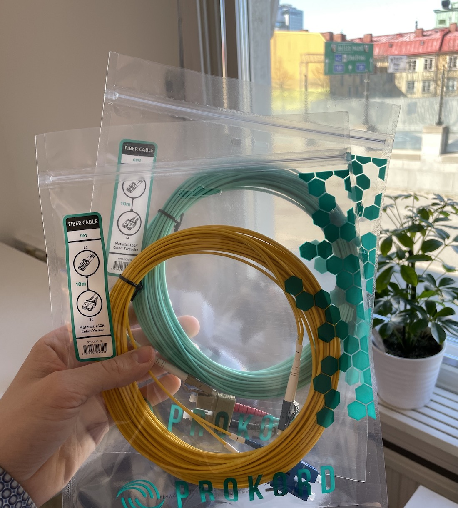
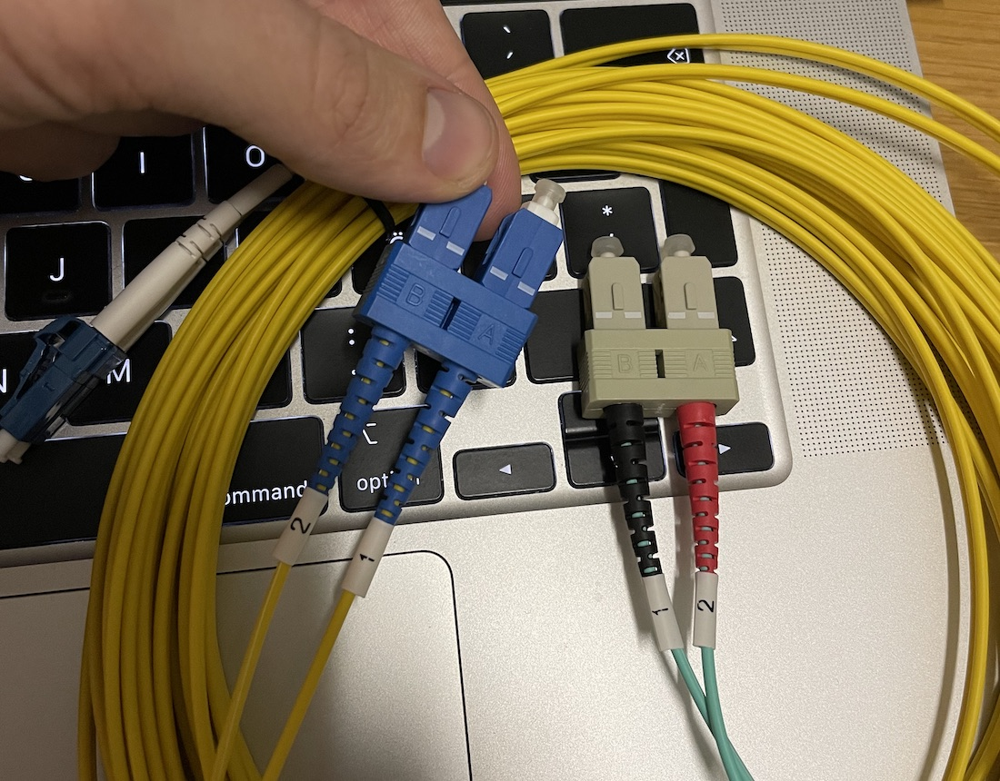
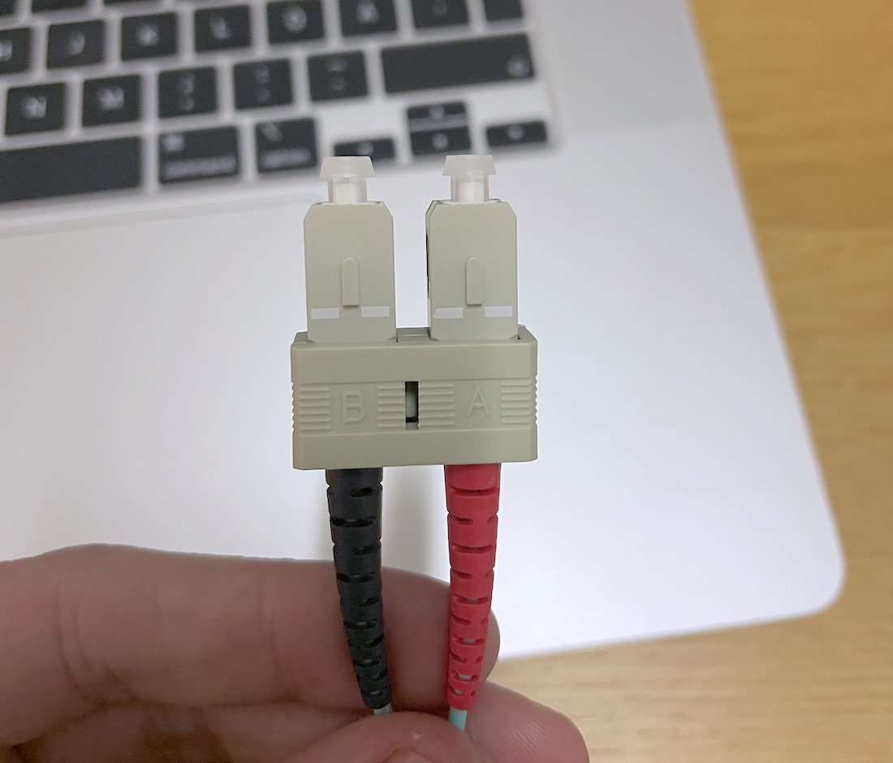
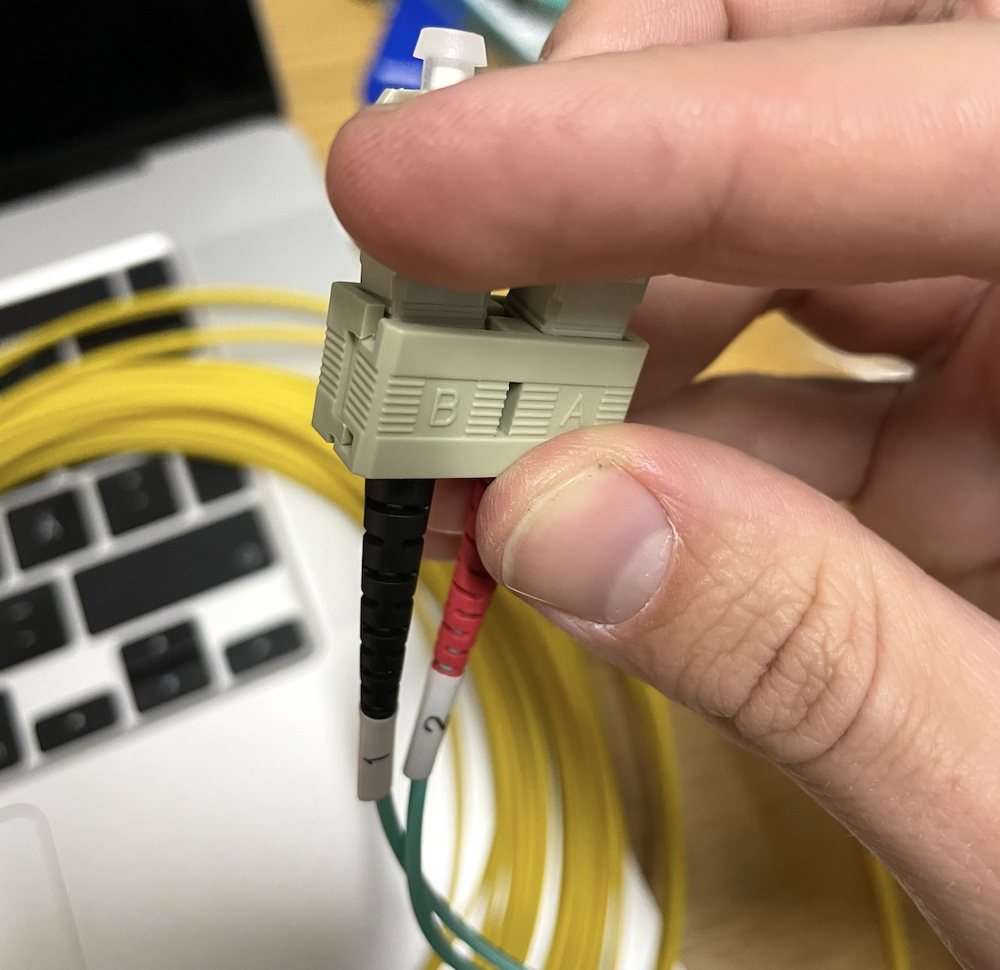
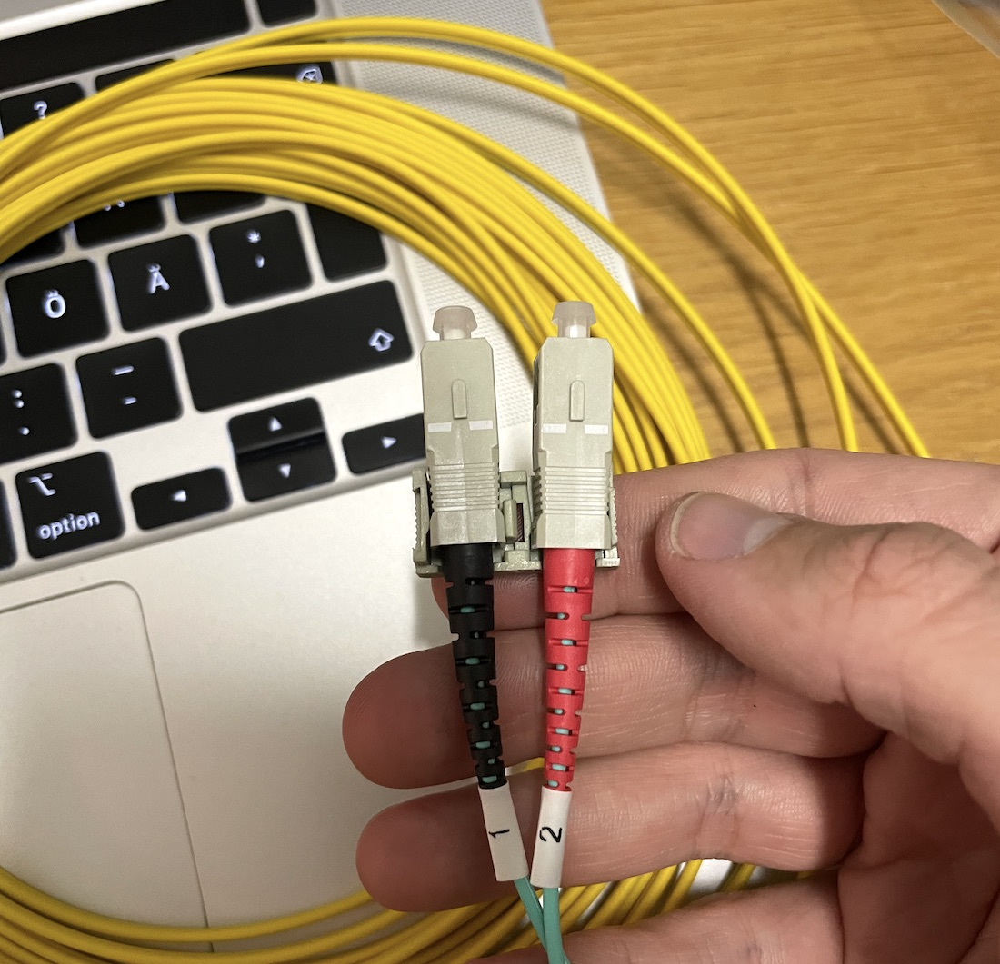
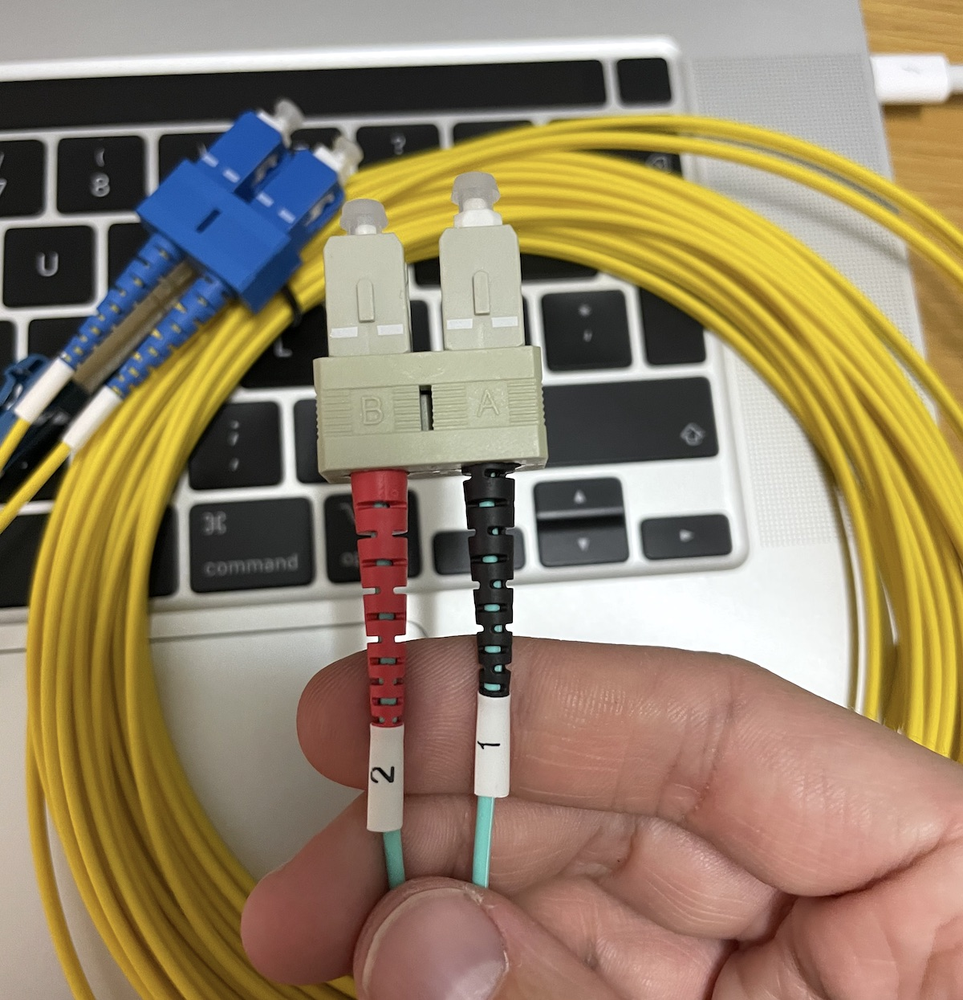

# Flipping the pairs of a fibre optic SC connector

**Today, I ran into a minor hiccup while doing some prep work for connecting up a 10Gbit/s internet
connection via fibre optics. The cable I bought had reversed polarity for the fibre pairs, so the Tx/Rx on my patch cable were the reverse of the shorter ISP provided one.**

## Background

My ISP just connected me up with a brand new fibre connection, and I now need to run a 10M fibre optic patch from where the fibre comes into my server room. 

I'm in no ways an expert when it comes to fibre optic 10Gbps networking, I'm a software engineer/small business owner by profession, but I'm also a firm believer in getting things done. So I'm diving headfirst into this world of fibre optics (or is it fiber optics?), 10Gbps networking, SFP+ transceiver modules, SFP+ DAC "cables", CAT.6A, LC- & SC-connectors, single-mode, multi-mode, OS*/OM* standards,  finding suitable ways to wire up an old house, etc. 

## Problem

**The patch cables I had bought wasn't working.** I had purchased both a single-mode (OS1) and a multi-mode (OM3) cable.  A single-mode is the better standard for those not familiar, where a laser lights up a thin high-quality fibre (highly directional); this enables higher speeds, and longer transmit runs but not required for 10Gbps. Multi-mode is a lesser standard where a LED lights up a lower quality thicker fibre; thus, the light bounces more. My preliminary research leaned towards single-mode in my installation, based on specs from the provided SFP+ transceiver module. But the ISP patch wasn't marked in any way, no OS/OM standard. 

_I've already fixed the yellow cable, and we're going to do the same thing with the blue one._

## Solution

My problem was that the pairs on my cables are in the wrong order. The only issues were that the connectors in both ends had a plastic gauntlet preventing me from switching the Tx and Rx strand around. Fibres being somewhat fragile made me a bit cautious with trying to break apart the plastic gauntlet. But after some careful inspection, it looked like it might be possible to pick apart the SC connecter without breaking anything. I found out that we can do it in 3 easy steps.

_This is what my SC connector looks like before starting_

1. Wiggle the connectors gently back and forth like in this picture until the plastic parts around the SC connector come apart.

2. With the plastic lid off, we can easily switch places between the two SC connectors in the pair.

3. Gently push the lid back on, and we're done!

It turns out that both the multi-mode and single-mode cable worked perfectly in my setup once I had flipped pairs. So now I know that in some cases, I can use them interchangeably.

## Conclusion

With both my fibre cables, some gentle bending back and forth made the gauntlet come apart, making it possible to switch up the Tx/Rx pairs.

At times I feel like I'm in over my head. But on the other hand, I find it very satisfying when things work, and it's a fun change of pace from my usual day-to-day. I write this mainly to document these small findings for myself to go back and remember how I fixed various problems later. It's a nice bonus if it's of any help to you.

Pardon me if you are a fibre network professional, and I've messed up some trivial detail. If that's the case, I'd highly appreciate it if you'd email your corrections to Alex at the domain of this site.

_/ Alexander Hultnér_
